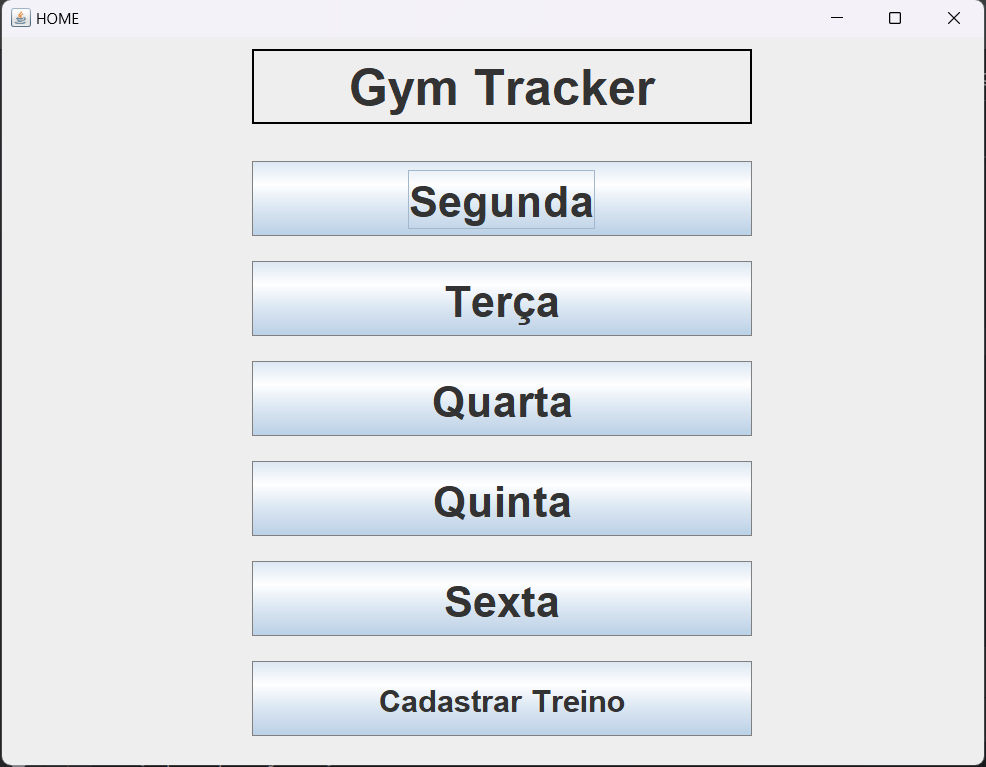
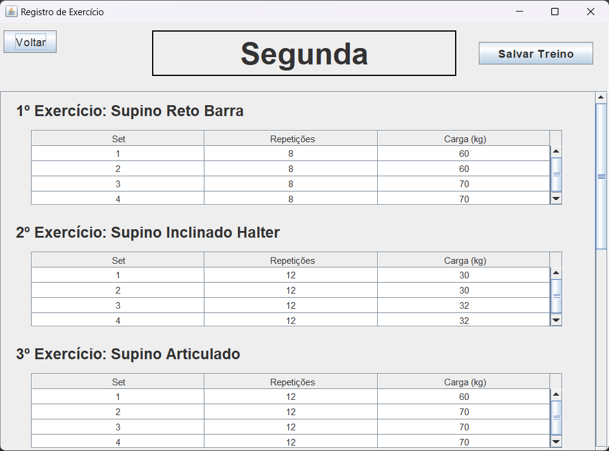
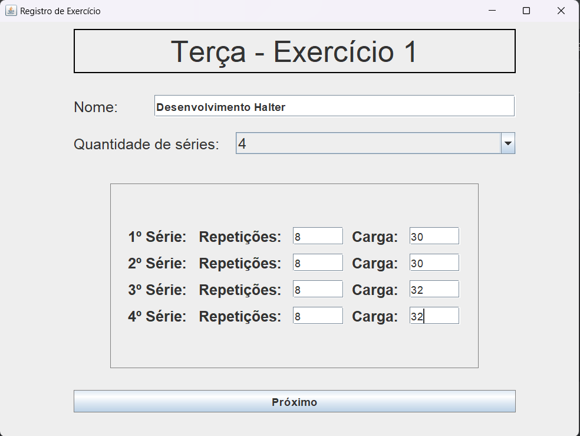

# Gym-Progress-App 🏋️

A Java Swing application integrated with MySQL, designed to help track and manage gym workouts. It is a personal project that I itend to continually improve.

## Features 🌟

- Register workouts with exercises, weights, and repetitions.
- View workouts in a clear and organized manner.

## Future Improvements 🚀

- Implement an algorithm to validate user entrys.
- Implement an algorithm to allow users to easily update weights or repetitions without needing to re-register the entire workout.

## Used Technologies 💻

- **Java Swing**: For the graphical user interface.
 **MySQL**: To store and manage workout data.

## Images 🖼️

